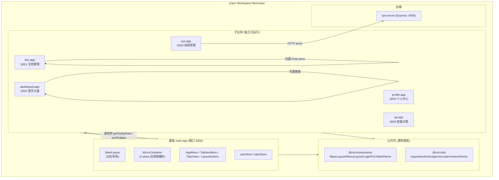
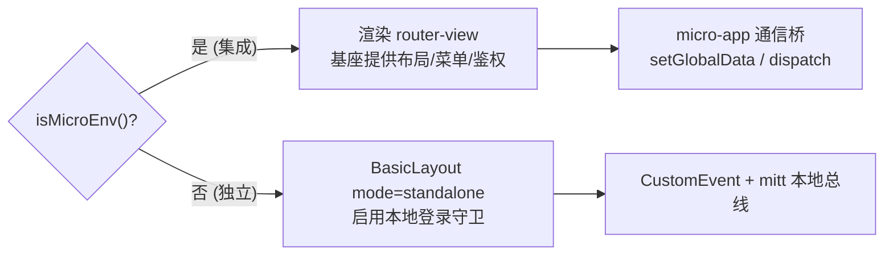
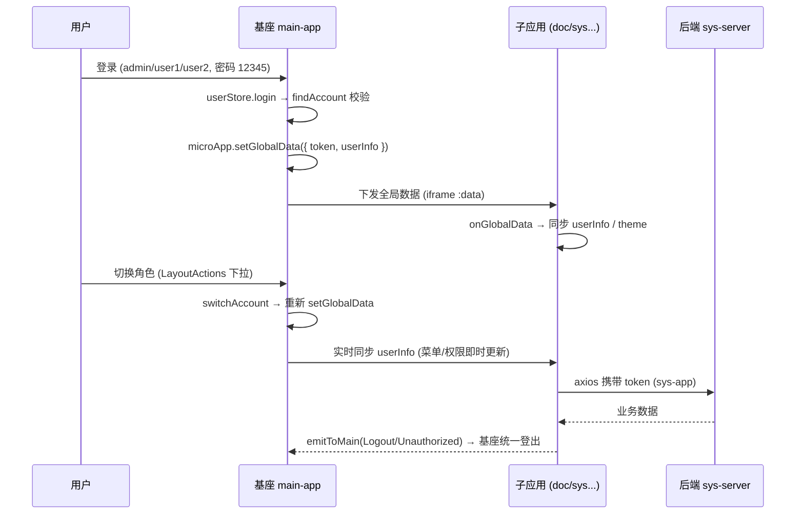
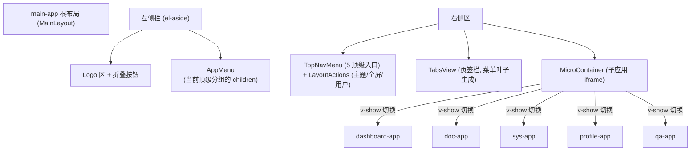
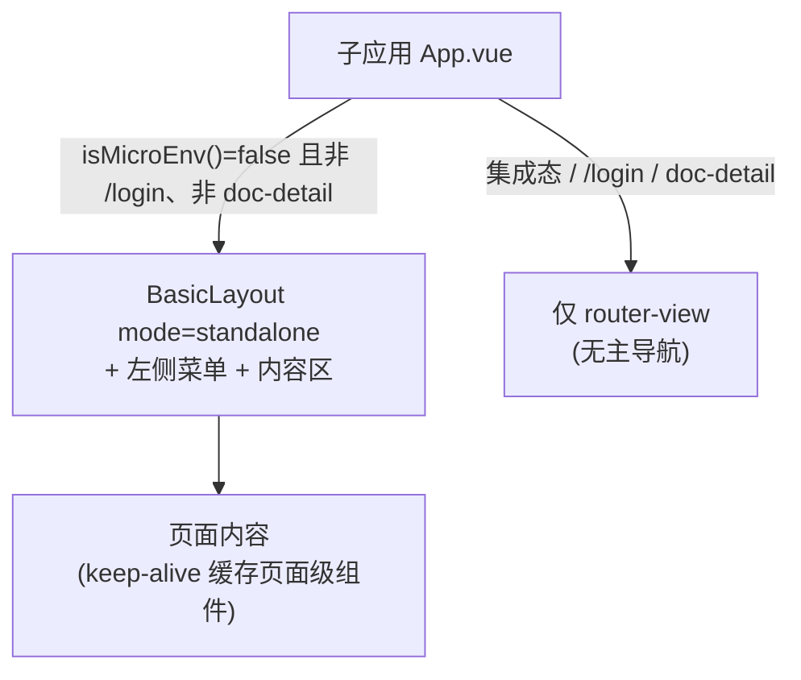
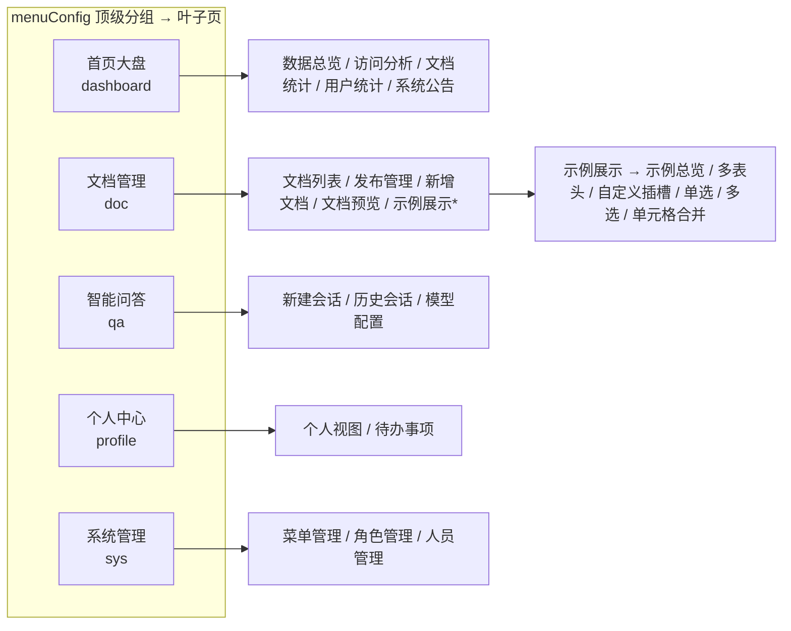

# 系统架构与页面布局说明

本文档基于当前 `mic-admin` 项目实际结构维护，包含系统架构图、数据流向、页面布局结构图，供开发人员快速理解项目。

> 与本文档配套的根目录 `README.md` 为项目总览文档，包含目录结构、核心功能、技术栈与维护方式。

---

## 1. 系统架构图

### 1.1 整体模块关系

项目为 **Vue 3 + Vite + TypeScript + Element Plus + micro-app** 的微前端 Monorepo。基座 `main-app` 以 `<micro-app iframe>` 沙箱加载 5 个子应用，子应用既可被集成运行，也可独立启动。

### 1.2 双形态运行（核心设计）

每个子应用依赖 `isMicroEnv()`（`@mic/utils/micro`）判断运行形态：

- **集成形态**：`App.vue` 只渲染 `<router-view>`，布局、菜单、鉴权由基座提供；路由用 `createWebHashHistory`，由基座分配 `baseroute`（`/doc`、`/sys`、`/dashboard`、`/profile`、`/qa`）。
- **独立形态**：自套 `@mic/components` 的 `BasicLayout mode="standalone"`，启用登录守卫（仅 `Login` 与受限页除外）。

### 1.3 数据流向（鉴权与通信）

要点：
- 登录为演示 mock，预设账号 `admin`/`user1`/`user2`，密码 `12345`（`packages/utils/src/permission.ts` 的 `ACCOUNT_PRESETS`）。
- 权限为「应用级」：`admin→['*']`、`user1→['doc']`、`user2→['sys']`；首页大盘/个人中心/智能问答为公共入口始终保留。
- 跨域：子应用 vite `server` 与 `preview` 均需 `cors: true` + `Access-Control-Allow-Origin: *`，端口固定 3000/3001/3002/3003/3004/3005/4000。

### 1.4 关键组件清单

| 层级 | 关键组件 / 模块 | 职责 |
| --- | --- | --- |
| 基座布局 | `MainLayout.vue` | 左右结构：左 logo+AppMenu+折叠，右 TopNavMenu+TabsView+内容区 |
| 基座容器 | `MicroContainer.vue` | 同时 `v-for` 挂载全部子应用，`v-show` 切换显隐（应用级缓存） |
| 公共布局 | `BasicLayout` | 独立运行时的布局外壳，含 `mode="standalone"` |
| 公共菜单 | `AppMenu` / `TopNavMenu` / `menuConfig` | 侧边菜单 / 顶部水平菜单 / 集中菜单配置 |
| 公共表格 | `ProTable` | 统一表格分页组件（内置请求/分页/排序/合并/多选/单选） |
| 通信桥 | `@mic/utils/micro/bridge.ts` | `getGlobalData`/`emitToMain`/`onGlobalData`/`onMicroMessage` |
| 业务 store | `userStore` / `tabsStore` / `useDocStore` | 用户、页签、文档数据 |

---

## 2. 页面布局结构图

### 2.1 基座布局（集成形态）

基座为 **左右结构**，顶部水平菜单（5 个顶级分组入口）+ 页签栏（菜单叶子生成）+ 内容区（子应用沙箱）。

折叠态：`el-aside` 宽 220px ↔ 64px，加 `transition: width 0.28s`；收起时背景为 `color-mix(in srgb, primary 30%, transparent)`。

### 2.2 子应用独立布局（独立形态）

### 2.3 主要页面层级与菜单结构

菜单集中在 `packages/components/src/menu/config.ts`，顺序固定：首页大盘 → 文档管理 → 智能问答 → 个人中心 → 系统管理。

> `*示例展示` 为 doc-app 下 ProTable 组件演示入口（含 5 类示例）。
> 文章详情页 `doc-detail` **刻意不加入菜单叶子**，仅可由文档列表「详情」按钮进入（受限入口，见 §13 文档规范）。

### 2.4 两层缓存策略

- **页面级（keep-alive）**：子应用 `App.vue` 对 `DocList/DocPublish/DocEdit/DocDetail/DocPreview`（doc-app）与 `MenuManage/RoleManage/UserManage`（sys-app）做 `keep-alive`，组件 `defineOptions({ name })` 须与 `include` 一致。
- **应用级（v-show）**：基座 `MicroContainer` 同时挂载全部 `<micro-app>`，靠 `v-show` 控制 `activeAppName`，切走不卸载，保留状态与查询条件。

---

## 3. 维护要点

- 改公共包（`@mic/components`、`@mic/utils`）源码后各应用 dev server 直接热更新（源码直连，不打包）。
- 涉及权限的改动需同步三处：`permission.ts`（预设账号）、`filterMenusByPermissions`（菜单过滤）、路由守卫（越权重定向）。
- 新增需要缓存的页面：在 `.vue` 加 `defineOptions({ name })` 并同步 `App.vue` 的 `include`。
- 新增子应用 SOP：复制模板 → 改 `menuConfig` → 改 `micro/apps.ts` 注册表与 `.env` URL → 加基座通配路由 → `pnpm install`。
- 文档构建告警（非阻塞）：`md-editor-v3`、`pdfjs-dist` 体积较大，构建时 index chunk 可能超 500kB。
