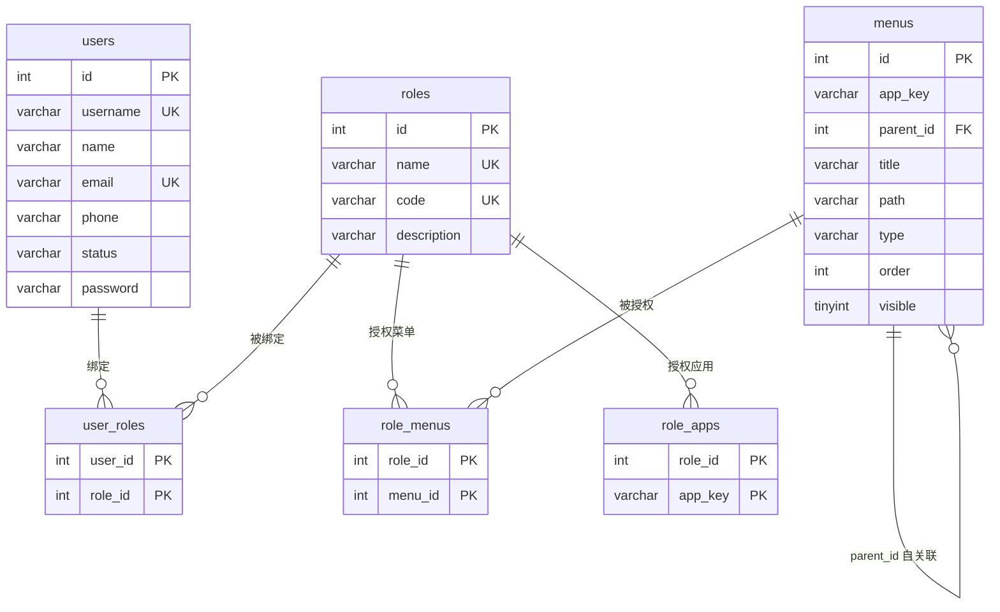

# MIC Admin 系统总结设计文档

> 版本：1.0 ｜ 更新日期：2026-08-27
> 适用范围：项目复盘、新成员上手、后续迭代参考

---

## 目录

1. [功能设计总览](#1-功能设计总览)
2. [技术栈说明](#2-技术栈说明)
3. [前端系统架构设计](#3-前端系统架构设计)
4. [登录功能设计](#4-登录功能设计)
5. [权限系统设计](#5-权限系统设计)
6. [表结构设计](#6-表结构设计)
7. [设计原因分析](#7-设计原因分析)
8. [替代方案对比](#8-替代方案对比)
9. [优化空间分析](#9-优化空间分析)

---

## 1. 功能设计总览

系统定位为**微前端架构的中后台管理平台**（MIC Admin 控制台），由 1 个基座（主应用）、5 个业务子应用、1 个后端服务和 2 个公共包组成。

### 1.1 整体模块图

```
┌──────────────────────────── 基座 main-app (:3000) ────────────────────────────┐
│  登录页 │ 顶栏导航 + 左侧菜单 + 多页签 │ 通知中心 │ 主题切换 │ 操作指引 │ 用户菜单 │
│                          （iframe 沙箱加载，v-show 保活）                      │
└──────┬──────────────┬──────────────┬──────────────┬──────────────┬──────────┘
       │              │              │              │              │
  dashboard-app    doc-app        sys-app      profile-app      qa-app
   (:3002)         (:3001)        (:3003)       (:3004)        (:3005)
  首页大盘          文档管理        系统管理       个人中心        智能问答
  · 数据总览       · 文档列表      · 菜单管理     · 个人视图      · 新建会话
  · 访问分析       · 发布管理      · 角色管理     · 待办事项      · 历史会话
  · 文档统计       · 新增文档      · 人员管理                     · 模型配置
  · 用户统计       · 文档预览
  · 系统公告       · ProTable 示例
       └──────────────┴──────┬───────┴──────────────┴──────────────┘
                             │  HTTP REST (/api) + WebSocket (/api/notifications)
                    ┌────────▼─────────┐          ┌──────────────┐
                    │  server (:4000)  │◄────────►│  MySQL admin │
                    │  NestJS          │          │  (6 张表)     │
                    └──────────────────┘          └──────────────┘
```

### 1.2 各模块职责

| 模块 | 职责 | 关键文件/目录 |
|------|------|--------------|
| **main-app 基座** | 登录鉴权、全局布局（顶栏+侧栏+页签）、子应用注册与加载、登录态与权限下发、通知中心宿主、明暗主题 | `apps/main-app/src` |
| **dashboard-app** | 数据总览（核心指标）、访问分析、文档统计、用户统计、系统公告 | `apps/dashboard-app` |
| **doc-app** | 文档列表（查询/分页）、发布管理、新增/编辑文档、文档预览、ProTable 高级表格示例（多表头/插槽/单选/多选/单元格合并） | `apps/doc-app` |
| **sys-app** | 系统管理三大核心 CRUD：**菜单管理**（树形、层级校验）、**角色管理**（应用权限+菜单授权）、**人员管理**（账号/密码/角色绑定） | `apps/sys-app` |
| **profile-app** | 个人视图、待办事项 | `apps/profile-app` |
| **qa-app** | 智能问答：新建会话、历史会话、模型配置 | `apps/qa-app` |
| **server** | REST API（menu/role/user 三大资源 + 登录/角色切换）+ WebSocket 实时通知推送 | `server/src/modules` |
| **@mic/components** | 跨应用共享组件：布局（BasicLayout/LayoutActions）、菜单（TopNavMenu/AppMenu/menuConfig）、登录页、通知铃铛、ProTable、PageCard/SearchForm、driver.js 操作指引、主题 | `packages/components/src` |
| **@mic/utils** | 跨应用共享工具：request（axios 封装）、auth（token/用户信息）、storage（带过期封装）、micro（微前端通信桥）、permission（账号/权限预设）、theme、notify（WS 客户端）、constants、helpers | `packages/utils/src` |

### 1.3 模块间核心关联

- **基座 ↔ 子应用**：基座通过 `microApp.setGlobalData()` 下发 `{ token, userInfo, theme }`；子应用通过 `onGlobalData` 监听同步，通过 `datachange` 事件向基座发送 `unauthorized / logout / refresh-user / navigate` 消息（跨应用跳转）。
- **登录 ↔ 权限 ↔ 菜单**：登录成功后后端返回角色列表、当前角色、应用级权限与**菜单树**；基座直接用后端菜单渲染导航；切换角色时实时拉取新角色的菜单树并重算路由可见性。
- **角色管理 ↔ 菜单显示**：sys-app 中维护的角色-菜单（`role_menus`）、角色-应用（`role_apps`）绑定，直接决定各账号登录后看到的导航与可访问范围，实现"配置即生效"。
- **通知中心**：server 内存维护通知队列，通过 WebSocket 按用户定向推送；基座统一建连、铃铛展示、支持偏好过滤（静音类型/模块）与已读管理。

---

## 2. 技术栈说明

### 2.1 前端

| 技术 | 版本 | 用途 |
|------|------|------|
| Vue | 3.5.40 | 组合式 API（`<script setup>`） |
| Vite | 8.1.5 | 开发服务器与构建（`@vitejs/plugin-vue` 6.0.8） |
| TypeScript | 5.9.2 | 全量类型检查（`vue-tsc` 3.3.8） |
| Element Plus | 2.14.3 | UI 组件库（含 `@element-plus/icons-vue`） |
| Pinia | 4.0.2 | 状态管理 |
| vue-router | **5.2.0（注意非 4.x）** | 路由（hash 模式） |
| @micro-zoe/micro-app | **固定 1.0.0-rc.32（勿改 ^1.0.0）** | 微前端框架，**iframe 沙箱模式** |
| axios | 1.18.1 | HTTP 客户端 |
| mitt | ^3.0.1 | 事件总线 |
| driver.js | — | 分步式操作指引高亮 |

### 2.2 后端

| 技术 | 版本 | 用途 |
|------|------|------|
| NestJS | ^10.4.0 | 应用框架（Express 适配器） |
| mysql2 | ^3.11.0 | MySQL 连接池（promise API） |
| zod | ^3.23.8 | 请求体校验（schema 即类型） |
| ws + @nestjs/platform-ws | ^8.18.0 | 原生 ws 适配器，通知 WebSocket |
| dotenv | ^16.4.5 | 环境变量加载 |

### 2.3 数据库与运行时

| 项 | 说明 |
|----|------|
| MySQL | 库名 `admin`，字符集 `utf8mb4`（连接层每次建连 `SET NAMES utf8mb4` 防中文乱码），连接池 `connectionLimit: 10`，惰性连接 |
| Node.js | 运行时 26 |
| pnpm | 9.15.0（`packageManager` 字段锁定），workspace monorepo |

### 2.4 环境变量

| 变量 | 用途 | 示例 |
|------|------|------|
| `VITE_API_BASE_URL` | 前端请求 baseURL | `/api` |
| `VITE_DASHBOARD_APP_URL` 等 | 各子应用资源地址 | `http://localhost:3002` |
| `VITE_SYS_SERVER_URL` | 后端地址（通知 WS/REST） | `http://localhost:4000` |
| `MYSQL_HOST/PORT/USER/PASS/DB` | 服务端数据库连接（`server/.env.development`） | `127.0.0.1:3306/admin` |
| `PORT` | 服务端口 | `4000` |

---

## 3. 前端系统架构设计

### 3.1 Monorepo 目录结构

```
mic-admin/
├── apps/
│   ├── main-app/            # 基座 (:3000)
│   │   └── src/
│   │       ├── layout/MainLayout.vue      # 全局布局：顶栏+侧栏+页签+内容区
│   │       ├── views/                     # Login / MicroContainer / NotFound
│   │       ├── router/index.ts            # hash 路由 + 登录/权限守卫
│   │       ├── store/                     # user / tabs / notification
│   │       ├── micro/apps.ts              # 子应用注册表（配置化）
│   │       └── components/TabsView.vue
│   ├── dashboard-app/      # 首页大盘 (:3002)
│   ├── doc-app/            # 文档管理 (:3001)
│   ├── sys-app/            # 系统管理 (:3003)
│   │   └── src/{views,api,store,types}
│   ├── profile-app/        # 个人中心 (:3004)
│   └── qa-app/             # 智能问答 (:3005)
├── packages/
│   ├── components/         # @mic/components 共享组件
│   │   └── src/{layout,menu,login,notification,table,business,guide,theme}
│   └── utils/              # @mic/utils 共享工具
│       └── src/{request,auth,storage,micro,permission,theme,notify,constants,helpers}
├── server/                 # @mic/server NestJS 后端 (:4000)
│   ├── sql/                # schema.sql + 增量迁移脚本
│   └── src/{modules/{menu,role,user,notification},common}
├── docs/                   # 架构与部署文档
└── pnpm-workspace.yaml
```

> 公共包以**源码形式**消费（`optimizeDeps.exclude` 排除预构建），修改即热更，无需构建发布流程。

### 3.2 组件划分

**布局层（@mic/components/layout）**
- `LayoutActions`：右上角操作区（操作指引、主题切换、全屏、通知铃铛、用户菜单含"切换角色"子列表）。
- `BasicLayout`：子应用**独立运行**时的布局（standalone 模式）。

**菜单层（@mic/components/menu）**
- `TopNavMenu`：顶栏横向菜单（顶级分组，host/standalone 双模式）。
- `AppMenu`：左侧树形菜单。
- `config.ts`：`MenuItem` 类型、本地 `menuConfig`（独立运行兜底）、`matchMenuKey`（路径→激活项）、`stripAppPrefix`（剥前缀统一比较）、`filterMenusByPermissions`。

**业务层**
- `PageCard`：页面容器卡片（统一标题/面包屑规范）。
- `SearchForm`：查询表单封装。
- `ProTable`：高级表格（多表头/插槽/单选/多选/单元格合并）。

**通知（@mic/components/notification）**
- `NotificationBell`：铃铛+下拉面板（未读数、偏好设置、已读/清空）。

### 3.3 状态管理（Pinia）

| Store | 归属 | 职责 |
|-------|------|------|
| `user` | 基座 | token/userInfo（含角色列表、当前角色、权限、菜单树）、`login()`（调后端）、`switchRole(roleId)`、`logout()` |
| `tabs` | 基座 | 多页签集合：`addTab/setActive/reset`，路由变化时按 `matchMenuKey` 自动开签 |
| `notification` | 基座 | WS 连接生命周期、消息列表、未读数、偏好持久化、`reconnect()` |
| `sys-user` 等独立 store | 各子应用 | 独立运行时本地登录态；集成态从基座 `globalData` 同步覆盖 |

### 3.4 路由设计（基座）

- **hash 模式**（`createWebHashHistory`），规避静态部署与服务端路由配置。
- 结构：`/login` 公开路由；`/` 挂 `MainLayout`，children 为各子应用 **baseroute 通配**（如 `doc/:pathMatch(.*)*` → `MicroContainer`）+ `/404` 兜底。
- **守卫链**（`router.beforeEach`）：
  1. 非 public 路由无 token → `/login`；
  2. 已登录访问 `/login` → `/`；
  3. **应用级权限守卫**：访问 `/doc|/sys` 时校验 `hasAppPermission(permissions, appKey)`，越权重定向到 `firstAccessiblePath`（dashboard 恒可访问）。
- 基座路由 → 子应用子路由的映射：`MicroContainer` 监听路由变化，剥离 baseroute 前缀后 `microApp.router.push` 同步给激活的子应用（首次挂载由 `@mounted` 回调补同步）。

### 3.5 接口请求封装（@mic/utils/request）

基于 axios 的 `HttpClient` 类，核心能力：

| 能力 | 实现 |
|------|------|
| 统一 baseURL | `VITE_API_BASE_URL ?? '/api'` |
| 统一响应契约 | 后端全局拦截器保证 `{ code, message, data }`，前端判 `code !== 0` 即业务错误并 `ElMessage` 提示 |
| 请求防重 | `pendingMap`（method+url+params+data 为 key）+ `AbortController` 取消重复请求 |
| 认证头 | 自动附带 `Authorization: Bearer {token}` |
| 401 处理 | 集成态 `emitToMain({ type: 'unauthorized' })` 通知基座登出；独立态回调/提示 |
| 超时 | 15s |
| 多实例 | `createRequest(options)` 支持注入 `onUnauthorized`、关闭错误提示 |

开发态通过 vite `server.proxy` 将 `/api` 代理到 `http://localhost:4000`；生产态由 Nginx 同源转发（见 `docs/deploy/01-same-origin-nginx.md`）。

### 3.6 微前端加载与通信机制

- **注册表配置化**：`micro/apps.ts` 定义 name/url/baseroute/appKey，环境变量注入各子应用地址。
- **iframe 沙箱**：`<micro-app iframe>` 加载子应用，天然 JS/样式隔离，规避全局变量冲突。
- **按需懒加载 + 应用级缓存**：仅渲染「当前激活」或「已进入过」的子应用；首次进入才挂载（懒加载），切走后 `v-show` 隐藏不卸载（**保活**），返回时列表查询条件、表单草稿等状态原样保留。
- **数据下发**：`:data="globalData"`（token/userInfo/theme）变化自动下发到子应用 iframe。
- **事件上行**：子应用 `emitToMain()` → 基座 `@datachange` 统一处理 `Unauthorized/Logout/RefreshUser/Navigate`（跨应用跳转 `resolveAppRoute(appKey, subPath)`）。

### 3.7 构建与部署

- **构建**：每应用 `vue-tsc --noEmit && vite build`（类型检查前置）；`pnpm build` 全量递归。
- **预览**：`pnpm preview` 多端口并行产物预览。
- **部署形态**（docs/deploy）：
  1. **同源 Nginx**：基座与子应用静态产物同域路径分发（`/`、`/doc/`…），`/api` 反代 server，规避 CORS；
  2. **Docker Compose**：nginx + server + mysql 容器编排。

---

## 4. 登录功能设计

### 4.1 登录流程

```
LoginPage(用户名/密码)
   │ emit('submit')
   ▼
userStore.login() ──► POST /api/users/login
                        │ zod 校验 { username, password }
                        ▼
                 查 users 表（username 精确匹配）
                        │ ├─ 不存在 / 密码不匹配 → 40100「账号或密码错误」
                        │ ├─ status ≠ active   → 40300「账号已停用」
                        │ └─ 无绑定角色          → 40300「未绑定角色」
                        ▼
                 组装返回：token + user{id, username, name,
                        roles[], currentRoleId, permissions[], menus[]}
   │◄──────────────────┘
   ▼
setToken(token) + setUserInfo(info)   # localStorage 持久化（7 天过期）
token/userInfo 写入 Pinia
   ▼
router.push('/') → 路由守卫放行 → MainLayout 渲染后端菜单树
```

- **默认角色**：多角色账号（如 admin 绑定超管/文档编辑/系统管理员）登录后取**第一个绑定角色**为当前角色。
- 登录页提供演示账号标签（admin/editor/sysop/guest）一键填充（密码 `123456`），标签定义在 `ACCOUNT_PRESETS`，仅做 UI 提示，**校验一律走后端**。

### 4.2 认证机制与会话保持

| 项 | 当前实现 |
|----|---------|
| Token 形态 | `mock-token-{userId}-{时间戳}`，服务端**不存储**（无状态占位实现） |
| Token 携带 | 前端请求拦截器自动 `Authorization: Bearer xxx` |
| Token 解析 | 仅 `GET /users/role-data` 用正则从 token 提取 userId 做角色归属校验 |
| 会话持久化 | localStorage（`@mic/utils/storage` 带过期包装，默认 7 天），刷新页面/重开浏览器保持登录 |
| 过期处理 | storage 层读取时判 `expireAt` 过期即清除；后端无过期校验（见优化空间） |

### 4.3 刷新机制与登出

- **刷新**：当前无 refresh token 机制；token 过期后需重新登录。
- **登出**（`MainLayout.handleLogout`）：
  1. 二次确认（ElMessageBox）；
  2. `userStore.logout()`：清 token/userInfo storage；
  3. `tabsStore.reset()` 清页签、`notificationStore.destroy()` 断开 WS；
  4. `microApp.setGlobalData({ token: '', userInfo: null })` 通知子应用清理；
  5. 跳 `/login`。
- **被动登出**：子应用接口 401 → `emitToMain(unauthorized)` → 基座统一登出跳转。

---

## 5. 权限系统设计

### 5.1 权限模型（RBAC，应用级 + 菜单级）

```
users ──< user_roles >── roles ──< role_apps  >── (appKey 枚举: dashboard/doc/qa/profile/sys)
                              └──< role_menus >── menus（自关联树）
```

- **用户-角色**：多对多，一个账号可绑多角色。
- **角色-应用权限**（`role_apps`）：应用级授权，决定能进入哪些子应用。
- **角色-菜单权限**（`role_menus`）：菜单级授权，决定导航树的具体节点；勾选父级菜单时前端联动勾选全部子级。
- **两级粒度**：路由可见性按应用级控制（粗），导航树按菜单级渲染（细）；按钮级（操作级）权限方案见 [BUTTON-PERMISSION-DESIGN.md](./BUTTON-PERMISSION-DESIGN.md)（复用 `menus.permission` 字段，扩展 `role_menus.permissions`）。

### 5.2 权限数据流转

| 时机 | 动作 |
|------|------|
| 登录 | `POST /users/login` 一次性返回当前角色的 `permissions`（role_apps 的 appKey 列表）+ `menus`（role_menus ∩ visible=1 组装的树，顶级 key=appKey、叶子 key=`menu-{id}`） |
| 切换角色 | `GET /users/role-data?roleId=`（token 解析 userId + 校验角色归属）→ 返回新角色 permissions/menus → 更新 Pinia 与 localStorage → `tabsStore.reset()` 清失效页签 → `setGlobalData` 下发子应用 → 越权路由自动校正（`/sys` → 首个有权限应用） |
| 管理端变更 | sys-app 修改角色授权后，受影响账号**重新登录或切换角色**即生效 |

### 5.3 前端权限控制

| 层级 | 实现 |
|------|------|
| 路由守卫 | `beforeEach` 中 `/doc`、`/sys` 前缀校验 `hasAppPermission`；`hasAppPermission` 兼容 `'*'`、`appKey`、`appKey:action` 细粒度前缀 |
| 菜单渲染 | 基座菜单树**完全来自后端** `userInfo.menus`（数据源单一，无本地静态菜单与后端不一致问题）；本地 `menuConfig` 仅子应用独立运行时兜底 |
| 页签 | 切换角色后 reset，避免残留越权页签 |
| 按钮级 | 方案见 [BUTTON-PERMISSION-DESIGN.md](./BUTTON-PERMISSION-DESIGN.md)（规划：`v-permission` 指令 + `usePermission` + `menus.permission`/`role_menus.permissions` 标识 + 后端 `PermissionGuard`） |

### 5.4 后端接口鉴权

- **现状**：仅 `/users/role-data` 做了 token 解析 + 资源归属校验（防越权切换他人角色）；其余管理接口（菜单/角色/人员 CRUD）暂未加鉴权 guard。
- **统一防线**：zod 入参校验（42200 参数失败）、业务错误码（40000/40400/40100/40300）、全局异常过滤器兜底。

---

## 6. 表结构设计

数据库：MySQL，库名 `admin`，字符集 utf8mb4。共 6 张表。

### 6.1 表清单与字段

**users（人员）**

| 字段 | 类型 | 约束 | 说明 |
|------|------|------|------|
| id | int unsigned | PK, AUTO_INCREMENT | |
| username | varchar(50) | NOT NULL, **UNIQUE**(uk_users_username) | 登录账号（字母/数字/下划线） |
| name | varchar(50) | NOT NULL | 姓名 |
| email | varchar(100) | NOT NULL, **UNIQUE**(uk_users_email) | |
| phone | varchar(20) | NULL | 可空；**上送即存（含空串），未上送存 NULL** |
| status | varchar(20) | NOT NULL DEFAULT 'active', 索引 idx_users_status | active/disabled |
| password | varchar(100) | NULL | 登录密码（明文，初始默认 123456，见 7.6/9.1） |
| created_at / updated_at | datetime | NOT NULL, 默认/更新时间戳 | |

**roles（角色）**

| 字段 | 类型 | 约束 | 说明 |
|------|------|------|------|
| id | int unsigned | PK | |
| name | varchar(50) | NOT NULL, UNIQUE | 角色名（如「超级管理员」） |
| code | varchar(50) | NOT NULL, UNIQUE | 标识（`[A-Za-z0-9_-]+`） |
| description | varchar(200) | NULL | |
| created_at / updated_at | datetime | | |

**menus（菜单，自关联树）**

| 字段 | 类型 | 约束 | 说明 |
|------|------|------|------|
| id | int unsigned | PK | **层级编码 ID**（见 6.3） |
| app_key | varchar(20) | NOT NULL, 索引 idx_menus_app | 所属子应用 |
| parent_id | int unsigned | NULL, 索引 idx_menus_parent | 父级（NULL=顶级） |
| title | varchar(50) | NOT NULL | |
| icon | varchar(50) | NULL | Element Plus 图标名 |
| path | varchar(200) | NULL | 完整路径（含应用前缀，如 /sys/menu）；分组型为 NULL |
| type | varchar(20) | NOT NULL DEFAULT 'menu' | catalog/menu |
| order | int unsigned | NOT NULL DEFAULT 0 | 同级排序 |
| visible | tinyint(1) | NOT NULL DEFAULT 1 | 角色菜单树仅取 visible=1 |
| permission | varchar(50) | NULL | 预留按钮级权限标识 |
| created_at / updated_at | datetime | | |

**关联表（均为联合主键，无冗余字段）**

| 表 | 主键 | 语义 |
|----|------|------|
| user_roles | (user_id, role_id) | 用户↔角色 多对多 |
| role_menus | (role_id, menu_id) | 角色↔菜单 多对多 |
| role_apps | (role_id, app_key) | 角色↔应用 一对多枚举（app_key 无外键，为白名单枚举） |

### 6.2 ER 关系图



**关系说明**：users 1..N user_roles N..1 roles（多角色）；roles 1..N role_menus N..1 menus（多菜单）；menus 通过 `parent_id` 自关联成最多三级树；role_apps 的 app_key 是受 zod `appKeyEnum` 约束的枚举值而非物理外键。

### 6.3 菜单层级编码 ID 设计

菜单 ID 不用自增，而是**按层级编码的 8 位数字**：`应用段(2) + L1(2) + L2(2) + L3(2)`。

- 应用段：dashboard=10、doc=20、qa=30、profile=40、sys=50（`APP_KEY_CODE` × 1,000,000）。
- 例：`5010300` = sys(50) + L1=10(系统管理) + L2=30(人员管理) + L3=00。
- 优点：**按 id 数值升序即天然展示顺序**（列表 `ORDER BY id` 直接可用）；父级路径可直接从 id 位段解析（`parseSegments`）；新增菜单由 `buildMenuId(appKey, parentId, order)` 生成，同级 order 冲突即报错。
- 约束：最多三级（L3 不可再有子级）、同应用同级 order 不可重复（唯一性冲突校验）。

---

## 7. 设计原因分析

### 7.1 微前端选型：micro-app（iframe 沙箱）

- **沙箱隔离**：iframe 模式天然 JS 沙箱 + 样式隔离，多个子应用（Element Plus 多实例、全局变量）互不污染，是所有微前端方案中隔离最彻底的。
- **接入成本**：micro-app 基于 Web Components，子应用仅需在入口设置 baseroute 与生命周期挂载，无需像 qiankun 那样导出固定协议（本轮改造保留独立运行能力也得益于此）。
- **独立开发部署**：每个子应用独立 vite 端口/仓库路径、独立构建产物，团队可按应用拆分并行开发。

### 7.2 应用级 v-show 保活（而非切换即卸载）

后台系统的核心痛点是**列表页查询条件丢失**。`MicroContainer` 用 `loadedApps` 集合实现"首次进入才挂载（懒加载）+ 切走不卸载（保活）"：
- 首屏只加载当前应用，其他子应用按需挂载 → 首屏体积可控；
- 已访问应用 `v-show` 隐藏，DOM/组件实例/路由状态全保留 → 返回时条件原样；
- 相比 keep-alive 组件级缓存，应用级缓存粒度更粗但零心智负担。

### 7.3 菜单数据后端化（单一数据源）

菜单曾配置在前端 `menuConfig`，角色管理做成数据库后出现"两份真相"。改为**登录/切换角色时由后端按 `role_menus` 组装菜单树下发**：
- sys-app 里改角色授权，重新登录即生效，菜单管理页 CRUD 直接驱动全局导航；
- 前端不再维护 `filterMenusByPermissions` 的双重过滤逻辑（本地 menuConfig 降级为独立运行兜底）；
- 菜单树结构与前端 `MenuItem` 严格对齐（顶级 key=appKey 供路由高亮、叶子 key=`menu-{id}`），序列化零转换。

### 7.4 层级编码 ID（而非 parent_id+order 排序）

菜单树排序常见做法是查询后按 `order` 字段多级 sort。层级编码 ID 把**层级路径与顺序压缩进主键**：`ORDER BY id` 一条索引扫描即得最终展示序；`parseSegments(id)` 免查询即可判断层级深度。代价是 ID 语义复杂、迁移层级需换 ID（当前约束"最多三级、同级 order 唯一"将风险封闭在 create 时校验）。

### 7.5 zod 校验 + 统一响应结构

- zod schema 同时承担**运行时校验**（中文错误信息如「标识只能包含字母、数字、下划线和短横线」）与**TS 类型来源**（`z.infer`），杜绝接口类型与校验规则两套维护。
- 全局 `ResponseInterceptor` 统一 `{ code:0, message:'ok', data }`，前端拦截器按 code 分流，错误提示一处收口。
- **可空字段保存约定**：用户上送什么存什么（空串存空串），未上送保持数据库默认 NULL——语义由前端显式控制，后端不做隐式转换。

### 7.6 明文密码（现状权衡）

`users.password` 明文存储是**演示项目的有意取舍**：系统无独立鉴权模块，密码用于管理页直接设置/核对，默认密码 `123456` 可直接登录验证。生产化必须改造（见 9.1），但为当前迭代最小复杂度。

### 7.7 状态与通信：Pinia + globalData 双轨

- 基座内状态（user/tabs/notification）用 Pinia——组件树内响应式最优解；
- 跨 iframe 边界用 micro-app `globalData` 下发 + `datachange` 上行——微前端标准通道，token/userInfo/theme 一处变更全端同步（切换角色后子应用即时收到新权限）。

---

## 8. 替代方案对比

### 8.1 登录认证方案

| 方案 | 优点 | 缺点 | 结论 |
|------|------|------|------|
| **当前：mock token + 后端校验** | 零依赖、演示友好、userId 可从 token 解析 | 无签名防伪造、无过期语义、token 不可撤销 | 当前阶段够用 |
| JWT（HS256/RS256 签名） | 无状态可校验、标准过期/刷新、防篡改 | 无法主动吊销（需黑名单）、payload 可读 | **推荐的演进方向**（见 9.1） |
| Session + Cookie | 服务端可随时吊销、天然防 CSRF（SameSite） | 跨域部署需粘性会话/Redis 共享，微前端多域场景麻烦 | 容器化单服务可用，扩展性弱 |
| OAuth2/OIDC（Keycloak 等） | 企业级 SSO/MFA 开箱即用 | 引入身份提供方，运维成本高 | 多系统联合时再上 |

### 8.2 权限模型方案

| 方案 | 优点 | 缺点 | 结论 |
|------|------|------|------|
| **当前：RBAC（应用级+菜单级）** | 模型直观（三张关联表）、查询简单、管理页所见即所得 | 按钮级/数据级需另行扩展 | 中后台标准解，合理 |
| ACL（资源直接挂用户） | 无角色概念、极小系统简单 | 用户量增长后授权爆炸、无法批量管理 | 不适合 |
| ABAC/Casbin 策略引擎 | 表达力强（属性条件、数据行级） | 策略模型学习成本高、管理页需自研 | 需求数据级权限时局部引入 |
| 前端静态菜单+权限码 | 不依赖后端、渲染快 | 双源真相（本次改造刚解决的问题）、角色配置无法生效 | 已淘汰 |

### 8.3 前端微前端方案

| 方案 | 沙箱 | 样式隔离 | 保活 | 接入成本 | 结论 |
|------|------|---------|------|---------|------|
| **micro-app（iframe 模式）** | iframe 天然完整隔离 | 完整 | v-show 容易 | 极低（Web Components） | **当前选择**：隔离要求高的场景最优 |
| micro-app（with 模式） | JS Proxy 弱沙箱 | scoped 弱 | 容易 | 低 | 同域资源共享多时更快 |
| qiankun | Proxy 沙箱 | 弱 | 需 keep-alive hack | 中（生命周期协议） | 生态大但保活体验差 |
| 无界 wujie | iframe+proxy 混合 | 较强 | 支持 | 低 | 可作为备选对比项 |
| Module Federation | 无沙箱（运行时共享） | 无 | 天然单页 | 高（构建耦合） | 适合**同栈组件级**共享而非应用级隔离 |
| MPA + 跳转 | 天然隔离 | 天然 | 无（刷新丢状态） | 低 | 无状态整合简单，后台体验差 |

### 8.4 状态/通信与数据获取

| 维度 | 当前方案 | 备选 | 评价 |
|------|---------|------|------|
| 服务端状态 | 组件内 `request` 直调 + 手动 refetch | TanStack Query / SWR | 引入 Query 可统一缓存、失效重取（菜单/角色列表收益明显） |
| 跨应用通信 | globalData + datachange | CustomEvent / 共享 Worker | 当前方案即 micro-app 官方推荐，无必要更换 |

---

## 9. 优化空间分析

### 9.1 安全加固（优先级高）

1. **密码哈希存储**：`users.password` 改 bcrypt/argon2 哈希 + salt，注册/编辑走单向加密，登录改比对哈希；同步增加密码强度策略。
2. **真实 JWT**：`mock-token` 换签名 JWT（含 exp/iat/sub/roleId），后端加全局 `AuthGuard`（白名单：login/health）；配套 refresh token 静默续期。
3. **接口级鉴权**：菜单/角色/人员 CRUD 目前**无鉴权**，任何人可直调——上线前必须补 guard（按 `menus.permission` 做接口级授权点）。
4. **CORS 收紧**：`app.use(cors())` 允许全部来源，生产应白名单域名。
5. **防暴力破解**：登录接口加失败计数锁定/验证码；全站 HTTPS（当前明文密码走 HTTP）。

### 9.2 性能优化

1. **users 列表 N+1**：`UserService.list()` 对每行循环调 `loadRoleIds/loadRoleNames`（4 用户 9 次查询），应改 `LEFT JOIN + GROUP_CONCAT` 或 `WHERE IN` 批查后内存组装。
2. **菜单树重复组装**：登录与 role-data 每次全量查表组树，可按角色加进程内缓存（角色变更时失效）。
3. **通知历史内存存储**：`NotificationService.history` 上限 200 条存内存，重启即丢——落库（notifications 表）+ 分页拉取。
4. **子应用预加载**：空闲时（requestIdleCallback）预挂载下一个可能访问的子应用，消除首次切换白屏。

### 9.3 代码结构改进

1. **菜单双源收敛**：子应用独立运行仍用本地 `menuConfig`，与后端菜单存在漂移风险（数据库已出现「测试未上送」等偏差项）——独立模式也应走后端接口或用 schema 校验两源一致性。
2. **类型去重**：`AuthMenuItem`（utils）与 `MenuItem`（components）结构相同，应将类型上提到 `@mic/types` 共享包，消除 `as unknown as MenuItem` 断言。
3. **service 层 SQL 拼接**：`IN (...)` 动态拼 placeholder 多处重复，可抽 `buildInClause` 工具；`buildRoleData` 两次查询可合并。
4. **测试缺失**：全仓无单元/E2E 测试——优先给 `buildMenuId`（层级编码）、`buildMenuTree`、登录/权限守卫补 Vitest 用例。

### 9.4 体验与功能增强

1. **按钮级权限**：实现 `v-permission` 指令消费 `menus.permission`，补齐 RBAC 最后一环（管理接口同步鉴权）。
2. **token 无感刷新**：401 时静默 refresh 重放请求，替代当前直接登出。
3. **页签持久化**：tabsStore 落 localStorage，刷新后恢复工作现场。
4. **角色变更即时生效**：当前改授权需重新登录/切换角色才刷新菜单，可加"权限版本号"由 WS 推送强制客户端重拉。
5. **管理端体验**：菜单树拖拽排序（基于层级编码重算 ID）、人员管理批量导入（Excel）、操作审计日志表。

### 9.5 工程化

- **OpenAPI 文档**：NestJS 集成 `@nestjs/swagger`，zod schema 转开窗文档，前后端契约可视化。
- **CI/CD**：PR 流水线跑 `pnpm typecheck` + 单测 + 构建产物体积预算。
- **迁移管理**：当前靠手工 SQL（`server/sql/` 增量脚本），引入成熟迁移工具统一版本化执行。

---

## 附录：核心文件速查

| 关注点 | 文件 |
|--------|------|
| 登录/切换角色（后端） | `server/src/modules/user/user.service.ts` / `user.controller.ts` |
| 菜单/角色/人员 CRUD | `server/src/modules/{menu,role,user}/` |
| 通知推送（WS） | `server/src/modules/notification/` |
| 统一响应/异常/校验 | `server/src/common/{response.interceptor,all-exceptions.filter,schemas}.ts` |
| 登录态（前端） | `apps/main-app/src/store/user.ts` |
| 全局布局与角色切换 | `apps/main-app/src/layout/MainLayout.vue` |
| 路由与权限守卫 | `apps/main-app/src/router/index.ts` |
| 子应用加载/保活/通信 | `apps/main-app/src/views/MicroContainer.vue` / `micro/apps.ts` |
| 请求封装 | `packages/utils/src/request/index.ts` |
| token/用户信息持久化 | `packages/utils/src/auth/index.ts` / `storage/` |
| 菜单树构建（后端） | `user.service.ts` 的 `buildRoleData/buildMenuTree` |
| 菜单工具（前端） | `packages/components/src/menu/config.ts` |
| 建表与迁移 SQL | `server/sql/` |
